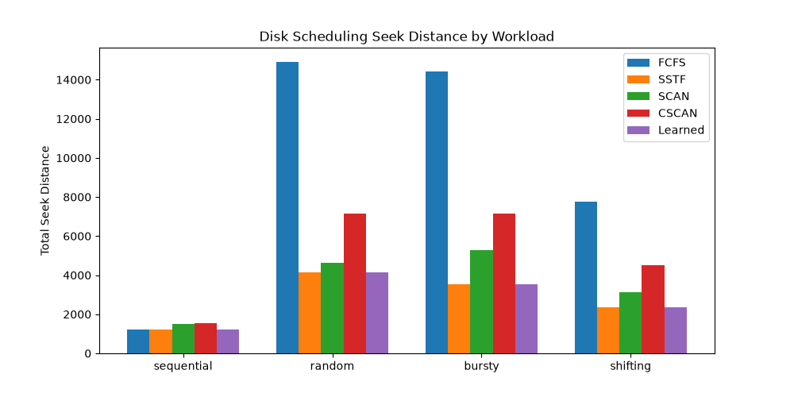

# Disk Scheduling: Learned Scheduler Selector

This repository implements an adaptive machine-learning layer over four classical disk scheduling algorithms: First-Come, First-Served (FCFS), Shortest Seek Time First (SSTF), SCAN, and C-SCAN. Requests are processed in windows, and a decision tree predicts which scheduler is expected to minimize seek distance for each window.

## How It Works

The project generates sequential, random, bursty, and shifting request traces. For each request window, it extracts four statistical features: track-position variance, request span, mean distance from the current head, and direction monotonicity. A decision tree is trained from synthetic workloads, with the scheduler producing the lowest seek cost used as each training label.

The experiment compares the four static scheduler strategies with the learned selector on sequential, random, bursty, and shifting traces. Each strategy carries its actual final head position from one window to the next. Results include cumulative seek distance, per-window best-scheduler labels, prediction correctness, and confidence summaries. The shifting trace is also summarized before and after its midpoint shift.

## Repository Structure

- `src/schedulers.py`: FCFS, SSTF, SCAN, and C-SCAN implementations
- `src/workloads.py`: Sequential, random, bursty, and shifting trace generators
- `src/features.py`: Request-window feature extraction
- `src/selector.py`: Decision tree training and scheduler prediction
- `src/simulate.py`: Static-versus-learned window simulation and per-window evaluation
- `tests/`: Pytest coverage for schedulers and simulation behavior
- `results/`: Generated metrics and comparison plot
- `run_experiment.py`: Experiment entry point
- `requirements.txt`: Python dependencies

## Setup and Run

Install the dependencies:

```bash
python -m pip install -r requirements.txt
```

Run the test suite:

```bash
pytest tests/
```

Run the four-workload experiment from the repository root:

```bash
python run_experiment.py
```

On Windows, use `py` in place of `python` if that is how Python is installed. The experiment writes `results/metrics.json` and `results/fig1_cumulative_excess.png`.

## Results

The current generated run evaluates 200 requests in 20 windows for each trace. The table reports cumulative seek distance; lower is better.

| Strategy | Sequential | Random | Bursty | Shifting |
| --- | ---: | ---: | ---: | ---: |
| FCFS | 1,219 | 14,895 | 14,430 | 7,768 |
| SSTF | 1,213 | 4,132 | 3,519 | 2,355 |
| SCAN | 1,517 | 4,646 | 5,280 | 3,129 |
| C-SCAN | 1,549 | 7,139 | 7,130 | 4,502 |
| Learned selector | 1,213 | 4,132 | 3,519 | 2,355 |

In this generated run, the selector matches SSTF's total on each trace. Its per-window accuracy against the best scheduler was 85% on sequential, 95% on random, 95% on bursty, and 90% on shifting. On the shifting trace, accuracy was 80% before the shift and 100% after it. These are results from one synthetic run, not a guarantee of performance on other traces.

| Shifting phase | FCFS | SSTF | SCAN | C-SCAN | Learned | Selector accuracy |
| --- | ---: | ---: | ---: | ---: | ---: | ---: |
| Before shift (10 windows) | 531 | 531 | 829 | 853 | 531 | 80% |
| After shift (10 windows) | 7,237 | 1,824 | 2,300 | 3,649 | 1,824 | 100% |

Confidence was not consistently higher on correct choices: mean confidence on correct versus incorrect choices was 0.961 versus 0.552 for sequential, 0.895 versus 0.750 for random, 0.931 versus 0.952 for bursty, and 0.944 versus 0.551 for shifting. The bursty result is a counterexample to treating the model's maximum class probability as calibrated confidence. The JSON also contains Brier scores and confidence-bin summaries; with only 20 windows per trace, these are exploratory measurements.



## AI Assistance

GitHub Copilot assisted with implementation and debugging. The author is responsible for reviewing and understanding the submitted code and for producing their own experimental interpretation and report.